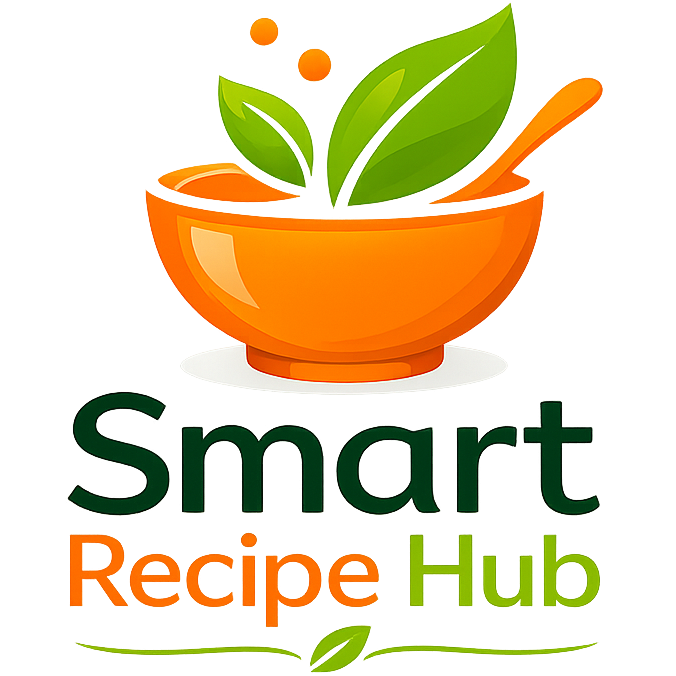
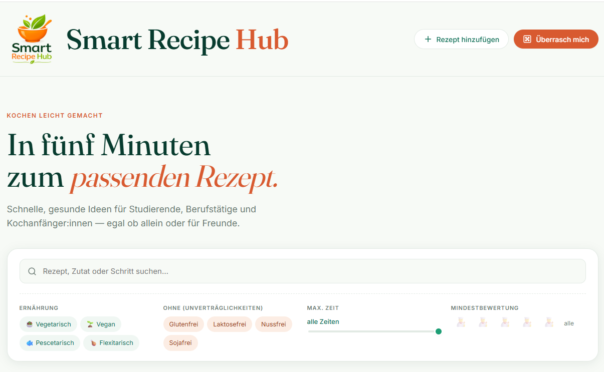
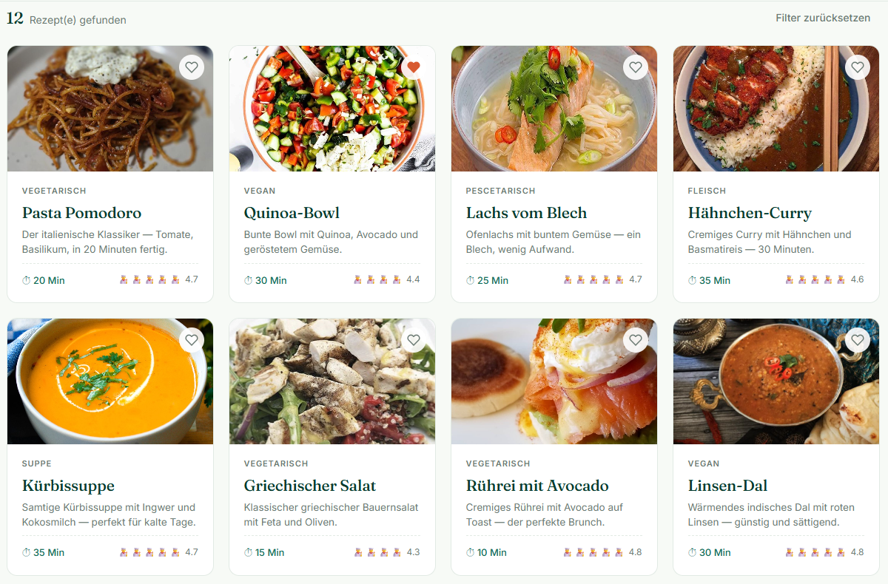
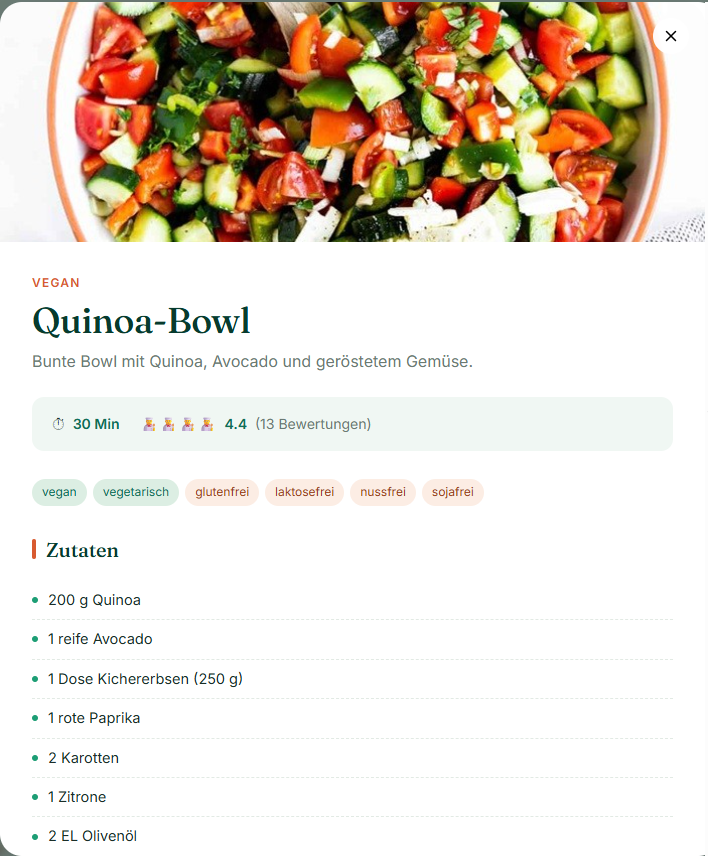
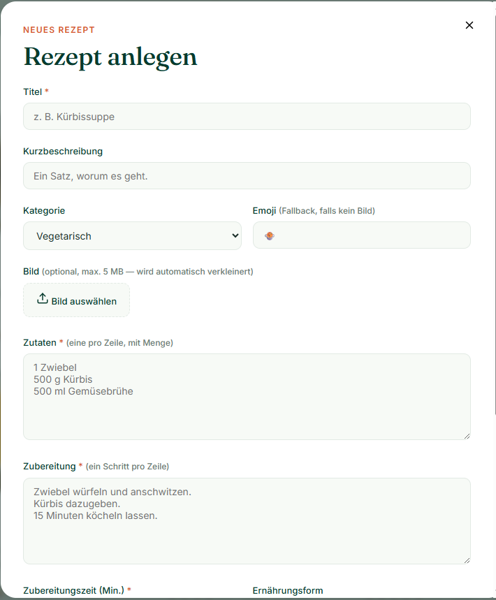

<p align="center">
  
</p>

# Smart Recipe Hub – Agile MVP Projekt

## Projektübersicht

Wie können Menschen schneller passende Rezepte finden und gleichzeitig eine moderne, intuitive Nutzererfahrung erhalten?

Smart Recipe Hub ist ein agiles Mini-Projekt zur Konzeption eines MVP (Minimum Viable Product) für eine digitale Rezeptplattform.

Ziel des Projekts war die Entwicklung eines ersten Prototyps, der Nutzerinnen und Nutzern dabei hilft, schnell passende Rezepte zu finden und neue Rezeptideen zu entdecken.

Im Mittelpunkt standen dabei nicht nur Design und Benutzerfreundlichkeit, sondern insbesondere die Anwendung agiler Methoden wie User Stories, Backlog-Management, Sprintplanung und Teamarbeit.

Das Projekt wurde im Rahmen einer Teamarbeit durchgeführt und mit Scrum-Elementen sowie Jira organisiert.

---

## Produktidee

Smart Recipe Hub soll Nutzerinnen und Nutzern helfen, einfache, gesunde und alltagstaugliche Rezepte schneller zu finden.

Die Plattform richtet sich insbesondere an:

- Studierende
- Berufstätige
- Kochanfängerinnen und Kochanfänger
- Personen, die unkompliziert und schnell kochen möchten

Der Fokus liegt auf einer klaren, modernen und nutzerfreundlichen Darstellung.

---

## Projektziel

Ziel des Projekts war die Entwicklung eines MVP-Prototyps für eine digitale Rezeptplattform.

Dabei standen folgende Fragestellungen im Vordergrund:

- Welche Funktionen sind für ein erstes MVP wirklich notwendig?
- Wie können Nutzerinnen und Nutzer schnell passende Rezepte finden?
- Wie lassen sich Anforderungen in User Stories übersetzen?
- Wie kann ein Team mit Hilfe von Scrum und Jira zusammenarbeiten?
- Wie kann KI zur Unterstützung der Prototypenerstellung eingesetzt werden?

Der Schwerpunkt lag auf der Konzeption eines nutzerorientierten Produkts sowie auf der praktischen Anwendung agiler Projektmethoden.

---

## Agiler Projektansatz

Das Projekt orientierte sich an den Grundprinzipien des agilen Projektmanagements.

Auf Basis der Produktvision wurden zunächst Anforderungen analysiert und in User Stories überführt. Anschließend wurden die Aufgaben priorisiert und in einem Product Backlog strukturiert.

Die Projektorganisation erfolgte mit Hilfe von Jira. Dabei wurden Aufgaben verteilt, Arbeitsfortschritte dokumentiert und die Umsetzung des MVP schrittweise geplant.

Im Rahmen des Projekts kamen unter anderem folgende agile Methoden zum Einsatz:

- Product Backlog
- User Stories
- Sprintplanung
- Aufgabenpriorisierung
- Teamarbeit
- Iterative Verbesserung des Prototyps

Dadurch konnten Anforderungen strukturiert umgesetzt und kontinuierlich weiterentwickelt werden.

---

## Teamarbeit und Prompt Engineering

Das Projekt wurde gemeinsam im Team umgesetzt.

Ein zentraler Bestandteil bestand darin, Anforderungen an die Plattform zu definieren und diese in Form von Prompts zu formulieren. Die einzelnen Ideen der Teammitglieder wurden gesammelt, diskutiert und anschließend zu einem gemeinsamen Master Prompt zusammengeführt.

Auf dieser Grundlage wurde mit Unterstützung von KI ein erster funktionsfähiger Prototyp in HTML erstellt.

Der Fokus lag dabei auf:

- Anforderungsanalyse
- Prompt Engineering
- Zusammenarbeit im Team
- Iterativer Verbesserung des Prototyps
- Nutzerorientierter Gestaltung des MVP

Das Projekt zeigt, wie KI-Werkzeuge sinnvoll in agile Entwicklungsprozesse integriert werden können.

---

## MVP-Funktionen

Der entwickelte Prototyp enthält verschiedene Funktionen, die den Nutzenden eine einfache und intuitive Nutzung ermöglichen.

Zu den wichtigsten Funktionen gehören:

- Anzeige von Rezepten in einer übersichtlichen Kartenansicht
- Detailansicht mit Zutaten und Zubereitungsschritten
- Bewertung von Rezepten
- Kommentarfunktion
- Favoritenverwaltung
- Zufällige Rezeptauswahl
- Hinzufügen neuer Rezepte
- Export von Rezepten als PDF

Der Funktionsumfang wurde bewusst auf die wichtigsten Anforderungen eines MVP reduziert, um eine schnelle Umsetzung und frühes Nutzerfeedback zu ermöglichen.

---

## Designkonzept

Das Design orientiert sich an einer freundlichen, modernen und klaren Rezeptplattform.

Gestalterische Schwerpunkte:

- freundliche Farbgestaltung mit Grün- und Orangetönen
- klare visuelle Hierarchie
- großes Logo und Wiedererkennungswert
- einfache Navigation
- freundliche Tonalität
- moderne Kartenstruktur
- mobile-first-orientiertes Layout

---

## Verwendete Tools und Methoden

Im Rahmen des Projekts wurden verschiedene Methoden und Werkzeuge aus den Bereichen agiles Projektmanagement, Prototyping und KI-gestützte Entwicklung eingesetzt.

### Methoden

- Scrum-Grundlagen
- User Stories
- Product Backlog
- Sprintplanung
- Priorisierung von Anforderungen
- MVP-Konzept
- Prompt Engineering
- GitHub (Versionsverwaltung und Projektpräsentation)

### Tools

- Jira (Projektorganisation)
- HTML
- CSS
- JavaScript
- KI-Unterstützung für die Prototypenerstellung

Die Kombination aus agilen Methoden und KI-gestützter Entwicklung ermöglichte eine schnelle Umsetzung eines ersten funktionsfähigen Prototyps.

---

## Mein Beitrag

Im Rahmen des Teamprojekts habe ich insbesondere in den folgenden Bereichen mitgewirkt:

- Entwicklung und Strukturierung von Prompt-Ideen
- Mitarbeit bei der Erstellung des Master Prompts
- Unterstützung bei der Anforderungsanalyse und Produktkonzeption
- Gestaltung des Projektlogos „Smart Recipe Hub“
- Qualitätssicherung und Testen des Prototyps
- Identifikation von Verbesserungspotenzialen hinsichtlich Benutzerfreundlichkeit und Design
- Mitwirkung bei der Dokumentation und Präsentation des Projekts

Durch die Zusammenarbeit im Team konnte ein funktionsfähiger MVP-Prototyp entwickelt und schrittweise verbessert werden.

---

## Projektstruktur

Die Struktur wurde bewusst einfach gehalten, um den Fokus auf MVP-Konzeption, agile Methoden und die Nutzererfahrung zu legen.

```text
smart-recipe-hub-agile-mvp
│
├── app
│   └── index.html
│
├── assets
│   └── smart_recipe_hub_logo.png
│
├── images
│   ├── homepage.png
│   ├── recipe_cards.png
│   ├── recipe_detail.png
│   └── add_recipe.png
│
├── .gitignore
└── README.md
```

---

## Screenshots

### Startseite



### Rezeptübersicht



### Rezeptdetails



### Neues Rezept anlegen



---

## Projektkontext

Dieses Projekt entstand im Rahmen des Kurses „Agiles Projektmanagement mit Scrum“.

Ziel war die praktische Anwendung agiler Methoden anhand eines realitätsnahen Produktkonzepts. Der Schwerpunkt lag auf der Erstellung eines MVP, der Formulierung von User Stories, der Zusammenarbeit im Team sowie dem Einsatz von KI-Unterstützung zur Prototypenerstellung.

Das Projekt dient ausschließlich zu Lern- und Demonstrationszwecken.

---

## Projekt starten

1. Repository klonen oder herunterladen
2. Die Datei `app/index.html` im Browser öffnen

Es ist keine zusätzliche Installation erforderlich.

---
## Kontakt

GitHub: https://github.com/Natali-mary

---

👨‍🍳 Vielen Dank für Ihr Interesse an diesem Projekt.

**Schwerpunkte:** Agiles Projektmanagement · Jira · Prompt Engineering · MVP · Teamarbeit